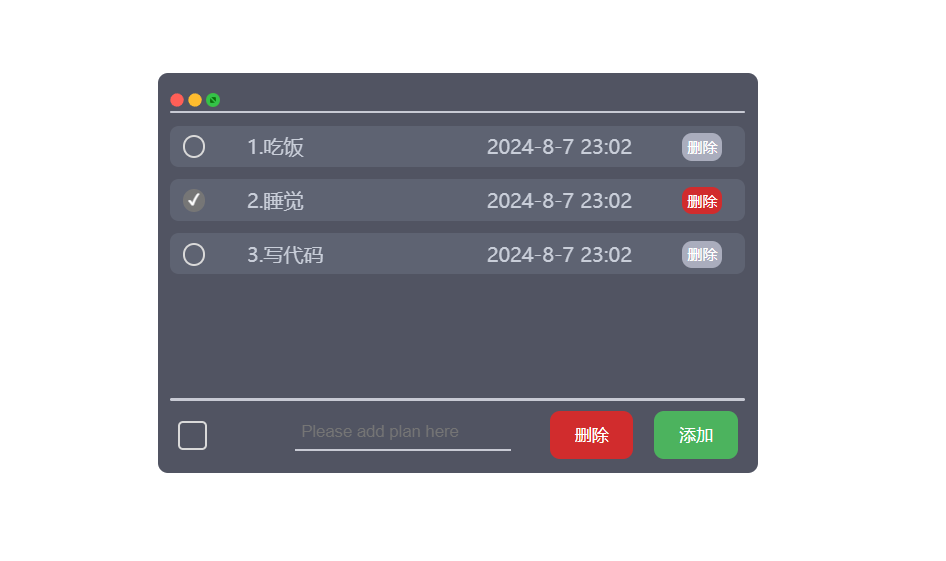

# lcw-todolist

An Electron application with Vue
The program function is to maintain a good schedule and keep it in a prominent position to remind yourself of your plan at all times

## Recommended IDE Setup

- [VSCode](https://code.visualstudio.com/) + [ESLint](https://marketplace.visualstudio.com/items?itemName=dbaeumer.vscode-eslint) + [Prettier](https://marketplace.visualstudio.com/items?itemName=esbenp.prettier-vscode) + [Volar](https://marketplace.visualstudio.com/items?itemName=Vue.volar)

## Project Setup

### Install

```bash
$ npm install
```

### Development

```bash
$ npm run dev
```

### Build

```bash
# For windows
$ npm run build:win

# For macOS
$ npm run build:mac

# For Linux
$ npm run build:linux
```

### Results picture


### program code path

> src/renderer/*
> This part is the program code folder implemented in vue
